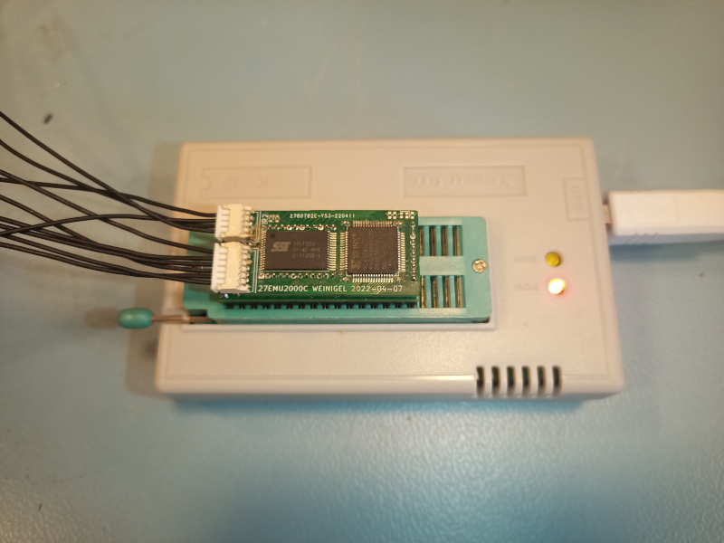

# En 27 series EPROM emulator

An 27-series EPROM emulator with in circuit programming.



This is the first spin and the hardware won't work properly.  /CS is
ignored so unless the EEPROM is the only device on the memory bus
reads from it can conflict with reads from other devices.

Planned EPROM variants:

| Model       | Package | Size (bits) | Size (words) | Comments		|
| ----------- | ------: | ----------: | -----------: | ----------------	|
| 27C1000     |   DIP32 |          1M |     128k x 8 |                  |
| 27C2000     |   DIP32 |          2M |     256k x 8 |                  |

# Description

A 3.3V flash memory with is used to store data.  A 5V tolerant CPLD
and a level shifter is used to do level translation between the 3.3V
flash memory and the 5V EEPROM pins.  The CPLD and level shifter can
also isolate the flash memory from the EEPROM pins so that the flash
memory can be progammed in circuit.  The 3.3V supply for the CPLD and
flash memory can be supplied from either the EEPROM pins or from the
programming connector so that the flash can be reprogrammed when the
cirucit is turned off.

The flash memory can be programmed using JTAG boundary scan using the
same JTAG connector which is also used to program the CPLD or using
(TBD - protocol to be decided) over a separate in circuit programming
connector.

PDF files with the schematics can be found in the [Docs](Docs)
directory.

# Operation

The emulator consists of two bords.  The main board (27C2000C)
contains the CPLD, flash memory and programming connectors.  Another
board contains (27C2000) the level shifter, 5V to 3.3V power supply
and EPROM pins that fit a EPROM socket.  The main reason for using two
boards are size constraints, it's hard to find a CPLD with enough pins
which can be hand soldered and which will fit between the DIP pins.
The current variant of the second board has a DIP32 footprint and
should be compatible with 27C1000 and 27C2000 EPROMs, but it should be
easy to adapt this design to to other pinouts and smaller EPROMS.

The CPLD is connected to the address (A0_5V..A17_5V) and control
(CE_5V and OE_5V) pins on the 5V EPROM side and the address (A0..A17),
data (D0..D7) and control (CE, OE and WE) on the 3.3V flash memory
side.  A level shifter also interfaces between the 5V data
(D0_5V..D7_5V) and 3.3V data (D0..D7) pins.  In normal operation the
CPLD drives the 3.3V A0..A7, CE and OE pins with the signals from the
corresponding signals on the 5V side.  The level shifter drives the 5V
D0_5V..D7_5V pins the 3.3V data pins whenever OE_5V and CE_5V are low.

TODO this is not true right now, the circuit is buggy and will drive
the D0_5V..D7_5V pins whenever OE is low; the state of CE is ignored.
This has to be fixed in a future spin of the emulator.

The reason for using a separate level shifter is mostly that I could
not find a CPLD that can be hand soldered and which would have enough
pins and fit physically on the board.  A bonus though of using a
separate level shifter is that it will actually drive 5V onto the
D0_5V..D7_5V pins which could improve compatibility if the emulator is
used in a circuit which won't work if they were driven with 3.3V.

# Tools

The [tools](tools) directory contains some quick python hacks to talk
to the emulator using JTAG boundary scan using openocd.  This
directory also contains an openocd configuration for a Raspberry Pi 3.

[emu2000_bsdl.py](tools/emu2000_bsdl.py) uses boundary scan to show
the state all pins on the emulator and toggles one of the programming
lines just to see that it can be done.

[emu2000_prog.py](tools/emu2000_prog.py) uses boundary scan to program
the first 256 bytes of the flash memory with some test data.

If you have a minipro compatible PROM programmer you can plug the
emulator into it and read out the test data with:

```bash
sudo ./minipro -p 'MX27C1000@DIP32' -r foo.bin -y
```

The "-y" flag is neccessary because the emulator is actually more of a
ROM emulator and does not present the correct chip ID:

```
Found TL866II+ 04.2.86 (0x256)
Warning: Firmware is out of date.
  Expected  04.2.128 (0x280)
    Found     04.2.86 (0x256)
    WARNING: Chip ID mismatch: expected 0xC20E, got 0xFFFF (unknown)
    Reading Code...  1.05Sec  OK
```

You will need a BSDL file for the Xilinx XC9572XL chip.  The tools
assume that Xilinx ISE is installed /opt/Xilinx and that the BSDL file
is called /opt/Xilinx/14.7/ISE_DS/ISE/xc9500xl/data/xc9572xl_vq64.bsd .

To be abls to read BSDL files this BSDL parser is used:

> https://github.com/cyrozap/python-bsdl-parser

The minipro tool can be found here:

> https://gitlab.com/DavidGriffith/minipro

# Bugs and possible improvements

CE is ignored when deciding to drive D0_5V..D7_5V, only OE is
considered.  This means that if CE is actually used as a chip select,
reads from the emulator will conflict with reads from other devices.
This can be worked around by removing R2 or U3 and driving the DIR pin
of U2 from CE (TODO have to check the polarity).  In the future,
figure out a better way of doing this.  Decode CE and OE using the
CPLD and use a free pin to drive OE of U3.  Or do it with discrete
logic (CE_5V connected to OE of U3, OE_5V connected to DIR or the
inverter).

The current spin of the emulator was intended to have an onboard
oscillator and have two two programming signals using I2C or UART.
I'm probably going to switch to using a bidirectional variant of SPI
where the SCK signal replaces the oscillator.  One less component to
mount on the PCB and this ought to simplify the logic in the FPGA
quite a bit.

Currently A18 is connected to the flash memory so that a 512kx8 flash
could be used.  That's a bit unneccesary, drive A18 low or leave it
floating instead and just don't support a larger flash than 256kx8.
This would also free up a pin on the CPLD.

It might be possible to pull CE on the flash chip to ground
permanently so that it does not have to be connected to the CPLD.
If that can be done that would free up one pin on the CPLD.

Currently A17_5V and PGM_5V are not connected to the CPLD.  Those pins
are used for the programming interface.  Relocate A17 to some other
CPLD pin so that 27C2000 emulation will work.

It would be nice if the emulation could emulate not only a ROM but
acually a PROM which responds with an ID code.  To do that we'd need
to be able to observe the PGM pin and see if it is pulled to +12V.
Not that important, but would be nice to have.

Rename the mainboard to 27EMUMAIN or maybe EMU27MAIN.

Maybe rename the other board to EMU271000.
